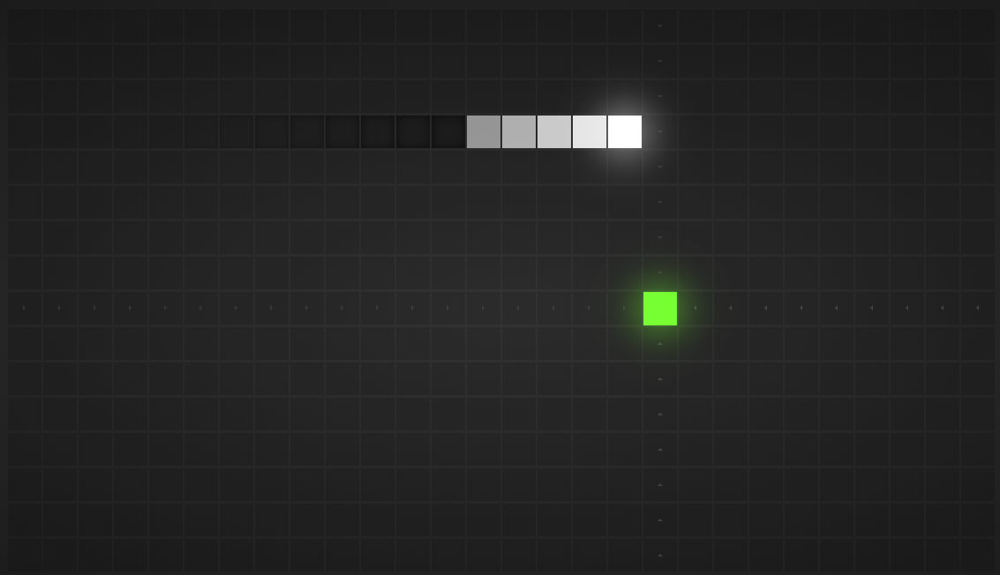

<h2 align="center">
Snake-Game  
</h2>

  

 

  
 &nbsp;
 &nbsp;
 &nbsp;
 &nbsp;

<h3 align="center">
    🔹
    <a href="https://github.com/ManojParkale/Snake-Game/issues">Report Bug</a> &nbsp; &nbsp;
    🔹
    <a href="https://github.com/ManojParkale/Snake-Game/issues">Request Feature</a>
</h3>

## TL;DR

You can fork this repo to modify and make changes of your own. Please give me proper credit by linking back to [ManojParkale](https://github.com/ManojParkale/Snake-Game). Thanks!

## Built With

My personal portfolio features some of my github projects as well as my resume and technical skills. 

This project was built using these technologies.

- JavaScript
- HTML
- CSS
- VsCode

## Features

**📖   Single-Page Layout**

**🎨 Styled with CSS, easy to customize colors**

**📱 Fully Responsive**

The page will reload if you make edits.
You will find all the components used and you can edit your information accordingly.

### Show your support

Give a ⭐ if you like this website!

